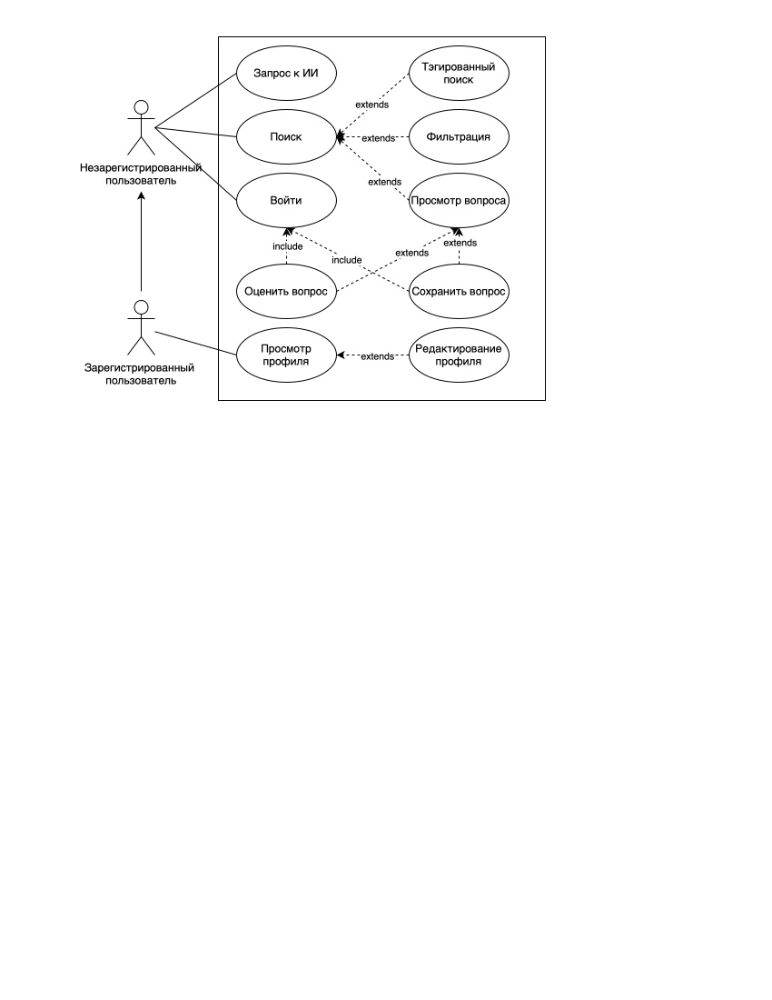
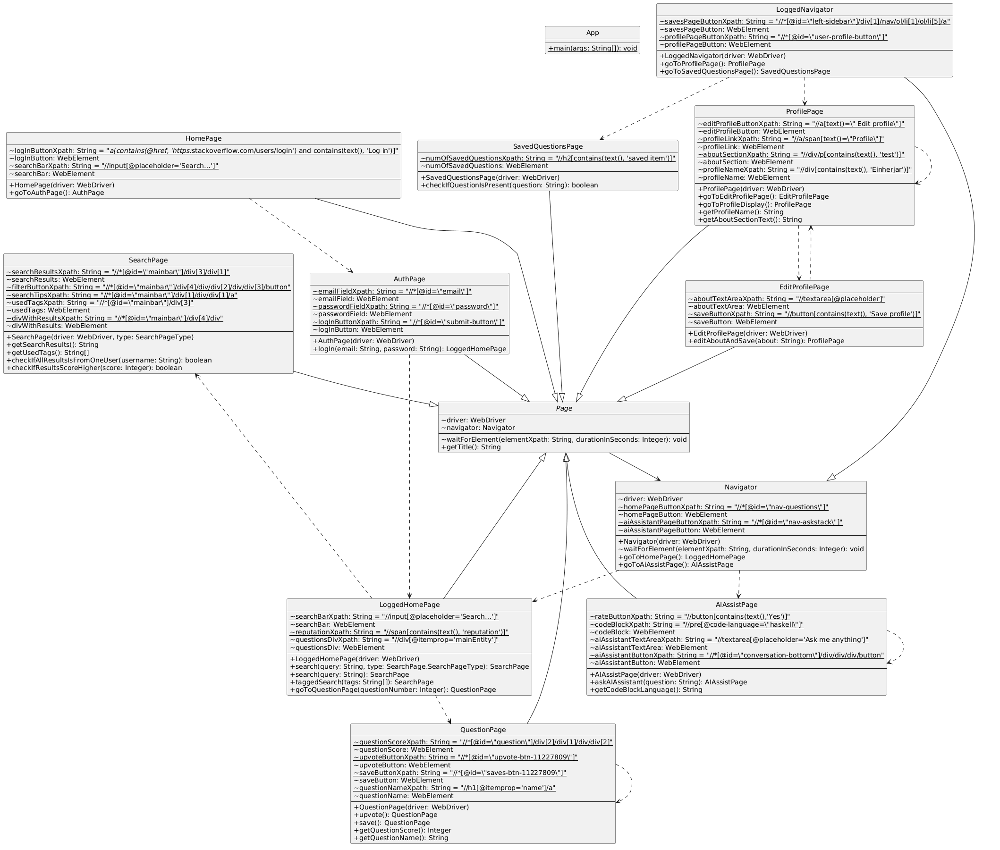

# Software Testing

## Лабораторная работа 3

- Выполнил: Кузьмин Артемий Андреевич
- Проверил: Наумова Надежда Александровна
- Вариант: `3211012`

## Цель работы

Научиться формировать тестовое покрытие и проводить функциональное тестирование интерфейса сайта на основе сформированных сценариев использования

## Задание

Вариант №3211012: Stackoverflow.com. A language-independent collaboratively edited question and answer site for programmers. - [http://stackoverflow.com/](http://stackoverflow.com/)

### Требования к выполнению работы

1. Тестовое покрытие должно быть сформировано на основании набора прецедентов использования сайта.
2. Тестирование должно осуществляться автоматически - с помощью системы автоматизированного тестирования Selenium.
3. Шаблоны тестов должны формироваться при помощи Selenium IDE и исполняться при помощи Selenium RC в браузерах Firefox и Chrome.
4. Предполагается, что тестируемый сайт использует динамическую генерацию элементов на странице, т.е. выбор элемента в DOM должен осуществляться не на основании его ID, а с помощью XPath.

## Ход выполнения работы

### Use-Case диаграмма

### Описание прецедентов использования

| Прецедент | Вход |
| -- | -- |
| ID | 1 |
| Краткое описание | Пользователь входит в аккаунт |
| Главные актеры | Незарегистрированный пользователь |
| Второстепенные актеры | Нет |
| Предусловия | Пользователь существует в системе |
| Основной поток | 1.1 Пользователь переходит на основную страницу  1.2 Пользователь переходит в раздел "Войти"  1.3 Пользователь вводит данные и подтверждает действие  1.4 Пользователь перенаправляется на основную страницу под своим профилем |

| Прецедент | Поиск |
| -- | -- |
| ID | 2 |
| Краткое описание | Пользователь ищет вопросы на сайте по ключевым словам |
| Главные актеры | Незарегистрированный пользователь |
| Второстепенные актеры | Нет |
| Предусловия | В системе есть хотя бы один вопрос, который удовлетворяет всем критериям поиска |
| Основной поток | 1.1 Пользователь переходит на основную страницу  1.2 Пользователь выбирает элемент для поиска и вводит запрос  1.3 ALT (Прецедент ID3): Пользователь дополняет свой запрос тегами  1.4 ALT (Прецедент ID4): Пользователь дополняет свой запрос фильтрами  1.5 Пользователь подтверждает поиск и видит результаты поиска  1.6 ALT (Прецедент ID5): Пользователь просматривает интересующий его вопрос |

| Прецедент | Тегированный поиск |
| -- | -- |
| ID | 3 |
| Краткое описание | Пользователь ищет вопросы на сайте по ключевым словам и тегам |
| Главные актеры | Незарегистрированный пользователь |
| Второстепенные актеры | Нет |
| Предусловия | В системе есть хотя бы один вопрос, который удовлетворяет всем критериям поиска |
| Основной поток | 1.1 Пользователь переходит на основную страницу  1.2 Пользователь выбирает элемент для поиска и вводит запрос с тегами  1.3 Пользователь подтверждает поиск и видит результаты поиска |

| Прецедент | Фильтрованный поиск |
| -- | -- |
| ID | 4 |
| Краткое описание | Пользователь ищет вопросы на сайте по ключевым словам и фильтрам |
| Главные актеры | Незарегистрированный пользователь |
| Второстепенные актеры | Нет |
| Предусловия | В системе есть хотя бы один вопрос, который удовлетворяет всем критериям поиска |
| Основной поток | 1.1 Пользователь переходит на основную страницу  1.2 Пользователь выбирает элемент для поиска и вводит запрос с фильтрами  1.3 Пользователь подтверждает поиск и видит результаты поиска |

| Прецедент | Просмотр вопроса |
| -- | -- |
| ID | 5 |
| Краткое описание | Пользователь просматривает вопрос, который нашел через систему поиска |
| Главные актеры | Незарегистрированный пользователь |
| Второстепенные актеры | Нет |
| Предусловия | Пользователь находится на странице результатов поиска с как минимум одним результатом |
| Основной поток | 1.1 Пользователь выбирает вопрос из списка результатов  1.2 Пользователь изучает вопрос  1.3 ALT (Прецедент ID6) Пользователь оценивает вопрос  1.4 ALT (Прецедент ID7): Пользователь сохраняет вопрос |

| Прецедент | Оценка вопроса |
| -- | -- |
| ID | 6 |
| Краткое описание | Пользователь оценивает просматриваемый вопрос |
| Главные актеры | Незарегистрированный пользователь |
| Второстепенные актеры | Нет |
| Предусловия | Пользователь находится на странице вопроса и пока еще не оценил его |
| Основной поток | 1.1 Пользователь повышает рейтинг вопроса 1.2 ALT (Прецедент 1): Если пользователь не вошел в аккаунт, то система перенаправляет его на страницу аутентификации  1.3 Пользователь видит изменение рейтинга |

| Прецедент | Сохранение вопроса |
| -- | -- |
| ID | 7 |
| Краткое описание | Пользователь сохраняет просматриваемый вопрос |
| Главные актеры | Незарегистрированный пользователь |
| Второстепенные актеры | Нет |
| Предусловия | Пользователь находится на странице вопроса и пока еще не сохранил его |
| Основной поток | 1.1 Пользователь сохраняет вопрос 1.2 ALT (Прецедент 1): Если пользователь не вошел в аккаунт, то система перенаправляет его на страницу аутентификации  1.3 Пользователь видит подтверждение сохранения вопроса |

| Прецедент | Запрос к ИИ |
| -- | -- |
| ID | 8 |
| Краткое описание | Пользователь задает вопрос к ИИ |
| Главные актеры | Незарегистрированный пользователь |
| Второстепенные актеры | Нет |
| Предусловия | Сервис с ИИ доступен |
| Основной поток | 1.1 Пользователь переходит на основную страницу 1.2 Пользователь переходит в раздел "ИИ"  1.3 Пользователь задает вопрос и подтверждает действие  1.4 Пользователь получает ответ на вопрос |

| Прецедент | Просмотр профиля |
| -- | -- |
| ID | 9 |
| Краткое описание | Пользователь просматривает информацию о своем профиле |
| Главные актеры | Зарегистрированный пользователь |
| Второстепенные актеры | Нет |
| Предусловия | Нет |
| Основной поток | 1.1 Пользователь переходит на основную страницу 1.2 Пользователь переходит в раздел "Профиль"  1.3 Пользователь изучает информацию  1.4 ALT (Прецедент ID10): Пользователь редактирует данные профиля |

| Прецедент | Редактирование профиля |
| -- | -- |
| ID | 10 |
| Краткое описание | Пользователь редактирует свой профиль |
| Главные актеры | Зарегистрированный пользователь |
| Второстепенные актеры | Нет |
| Предусловия | Пользователь находится на странице профиля |
| Основной поток | 1.1 Пользователь переходит в раздел "Редактировать"  1.2 Пользователь изменяет информацию  1.3 Пользователь сохраняет изменения  1.4 Пользователь видит измененную информацию |

### UML диаграмма классов

### Описание тестовых сценариев

#### Переход на главную страницу

| № | Начальное состояние | Ввод | Действие системы | Вывод | Конечное состояние |
| - | - | - | - | - | - |
| 1 | Готов | Пользователь вводит url веб-приложения | Отображение основной страницы | - | Готов |

#### Вход в систему

| № | Начальное состояние | Ввод | Действие системы | Вывод | Конечное состояние |
| - | - | - | - | - | - |
| 1 | Готов | Пользователь нажимает на кнопку "Log in" | Отображение страницы аутентификации | Приглашение ввести логин и пароль | Ожидание логина и пароля |
| 2 | Ожидание логина и пароля | Пользователь вводит логин EMAIL | Ожидание | Приглашение ввести пароль | Ожидание пароля |
| 3 | Ожидание пароля | Пользователь вводит пароль PASSWORD | Запрос к SSO | Система отображает домашнюю страницу | Готов |

#### Поиск вопросов

| № | Начальное состояние | Ввод | Действие системы | Вывод | Конечное состояние |
| - | - | - | - | - | - |
| 1 | Готов | Пользователь нажимает на кнопку "Log in" | Отображение страницы аутентификации | Приглашение ввести логин и пароль | Ожидание логина и пароля |
| 2 | Ожидание логина и пароля | Пользователь вводит логин EMAIL | Ожидание | Приглашение ввести пароль | Ожидание пароля |
| 3 | Ожидание пароля | Пользователь вводит пароль PASSWORD | Запрос к SSO | Система отображает домашнюю страницу | Готов |
| 4 | Готов | Пользователь вводит в поисковую строку запрос "haskell quick sort" | Поиск совпадений | Система отображает страницу с результатами поиска | Готов |

#### Поиск вопросов по тегам

| № | Начальное состояние | Ввод | Действие системы | Вывод | Конечное состояние |
| - | - | - | - | - | - |
| 1 | Готов | Пользователь нажимает на кнопку "Log in" | Отображение страницы аутентификации | Приглашение ввести логин и пароль | Ожидание логина и пароля |
| 2 | Ожидание логина и пароля | Пользователь вводит логин EMAIL | Ожидание | Приглашение ввести пароль | Ожидание пароля |
| 3 | Ожидание пароля | Пользователь вводит пароль PASSWORD | Запрос к SSO | Система отображает домашнюю страницу | Готов |
| 4 | Готов | Пользователь вводит в поисковую строку теги [java], [junit], [selenium-webdriver] | Поиск совпадений | Система отображает страницу с результатами поиска, отображая использованные теги | Готов |

#### Поиск вопросов по автору

| № | Начальное состояние | Ввод | Действие системы | Вывод | Конечное состояние |
| - | - | - | - | - | - |
| 1 | Готов | Пользователь нажимает на кнопку "Log in" | Отображение страницы аутентификации | Приглашение ввести логин и пароль | Ожидание логина и пароля |
| 2 | Ожидание логина и пароля | Пользователь вводит логин EMAIL | Ожидание | Приглашение ввести пароль | Ожидание пароля |
| 3 | Ожидание пароля | Пользователь вводит пароль PASSWORD | Запрос к SSO | Система отображает домашнюю страницу | Готов |
| 4 | Готов | Пользователь вводит в поисковую строку "user:1234" | Поиск совпадений | Система отображает страницу с результатами поиска, где все вопросы написаны пользователем "Jody Dawkins" | Готов |

#### Поиск вопросов по рейтингу

| № | Начальное состояние | Ввод | Действие системы | Вывод | Конечное состояние |
| - | - | - | - | - | - |
| 1 | Готов | Пользователь нажимает на кнопку "Log in" | Отображение страницы аутентификации | Приглашение ввести логин и пароль | Ожидание логина и пароля |
| 2 | Ожидание логина и пароля | Пользователь вводит логин EMAIL | Ожидание | Приглашение ввести пароль | Ожидание пароля |
| 3 | Ожидание пароля | Пользователь вводит пароль PASSWORD | Запрос к SSO | Система отображает домашнюю страницу | Готов |
| 4 | Готов | Пользователь вводит в поисковую строку "score:20000" | Поиск совпадений | Система отображает страницу с результатами поиска, где рейтинг всех вопросов больше 20000 | Готов |

#### Запрос к ИИ

| № | Начальное состояние | Ввод | Действие системы | Вывод | Конечное состояние |
| - | - | - | - | - | - |
| 1 | Готов | Пользователь нажимает на кнопку "Log in" | Отображение страницы аутентификации | Приглашение ввести логин и пароль | Ожидание логина и пароля |
| 2 | Ожидание логина и пароля | Пользователь вводит логин EMAIL | Ожидание | Приглашение ввести пароль | Ожидание пароля |
| 3 | Ожидание пароля | Пользователь вводит пароль PASSWORD | Запрос к SSO | Система отображает домашнюю страницу | Готов |
| 4 | Готов | Пользователь переходит в раздел "AI Assist" | Отображение страницы | Система отображает страницу чата с ИИ | Ожидание ввода вопроса |
| 5 | Ожидание ввода вопроса | Пользователь вводит "Haskell quick sort implementation" | Запрос к ИИ сервису | Система отображает ответ от ИИ ассистента | Ожидание ввода вопроса |

#### Просмотр профиля

| № | Начальное состояние | Ввод | Действие системы | Вывод | Конечное состояние |
| - | - | - | - | - | - |
| 1 | Готов | Пользователь нажимает на кнопку "Log in" | Отображение страницы аутентификации | Приглашение ввести логин и пароль | Ожидание логина и пароля |
| 2 | Ожидание логина и пароля | Пользователь вводит логин EMAIL | Ожидание | Приглашение ввести пароль | Ожидание пароля |
| 3 | Ожидание пароля | Пользователь вводит пароль PASSWORD | Запрос к SSO | Система отображает домашнюю страницу | Готов |
| 4 | Готов | Пользователь нажимает на иконку профиля | Отображение страницы | Система отображает страницу профиля | Готов |

#### Редактирование профиля

| № | Начальное состояние | Ввод | Действие системы | Вывод | Конечное состояние |
| - | - | - | - | - | - |
| 1 | Готов | Пользователь нажимает на кнопку "Log in" | Отображение страницы аутентификации | Приглашение ввести логин и пароль | Ожидание логина и пароля |
| 2 | Ожидание логина и пароля | Пользователь вводит логин EMAIL | Ожидание | Приглашение ввести пароль | Ожидание пароля |
| 3 | Ожидание пароля | Пользователь вводит пароль PASSWORD | Запрос к SSO | Система отображает домашнюю страницу | Готов |
| 4 | Готов | Пользователь нажимает на иконку профиля | Отображение страницы | Система отображает страницу профиля | Готов |
| 5 | Готов | Пользователь нажимает на кнопку "Edit profile" | Отображение страницы | Система отображает страницу редактирования профиля | Ожидание ввода изменений |
| 5 | Ожидание ввода изменений | Пользователь вводит "test" в поле About section | Ожидание | Приглашение ввести данные | Ожидание ввода изменений |
| 6 | Ожидание ввода изменений | Пользователь нажимает на кнопку "Save profile" | Сохранение изменений | Система отображает страницу профиля | Готов |

#### Оценка вопроса

| № | Начальное состояние | Ввод | Действие системы | Вывод | Конечное состояние |
| - | - | - | - | - | - |
| 1 | Готов | Пользователь нажимает на кнопку "Log in" | Отображение страницы аутентификации | Приглашение ввести логин и пароль | Ожидание логина и пароля |
| 2 | Ожидание логина и пароля | Пользователь вводит логин EMAIL | Ожидание | Приглашение ввести пароль | Ожидание пароля |
| 3 | Ожидание пароля | Пользователь вводит пароль PASSWORD | Запрос к SSO | Система отображает домашнюю страницу | Готов |
| 4 | Готов | Пользователь нажимает на первый рекомендуемый вопрос | Отображение страницы | Система отображает страницу вопроса | Готов |
| 5 | Готов | Пользователь нажимает на кнопку "upvote" | Сохранение обновления | Система отображает новый рейтинг | Готов |

#### Сохранение вопроса

| № | Начальное состояние | Ввод | Действие системы | Вывод | Конечное состояние |
| - | - | - | - | - | - |
| 1 | Готов | Пользователь нажимает на кнопку "Log in" | Отображение страницы аутентификации | Приглашение ввести логин и пароль | Ожидание логина и пароля |
| 2 | Ожидание логина и пароля | Пользователь вводит логин EMAIL | Ожидание | Приглашение ввести пароль | Ожидание пароля |
| 3 | Ожидание пароля | Пользователь вводит пароль PASSWORD | Запрос к SSO | Система отображает домашнюю страницу | Готов |
| 4 | Готов | Пользователь нажимает на первый рекомендуемый вопрос | Отображение страницы | Система отображает страницу вопроса | Готов |
| 5 | Готов | Пользователь нажимает на кнопку "save" | Обработка сохранения | Система отображает сохранение | Готов |
| 6 | Готов | Пользователь переходит в раздел "Saves" | Отображение страницы | Система отображает страницу сохраненных вопросов, среди которых есть сохраненный ранее вопрос | Готов |

### Чек-лист

| Тестовый сценарий | Результат | Комментарий |
| - | - | - |
| Переход на главную страницу | ОК | - |
| Вход в систему | ОК | - |
| Поиск вопросов | ОК | - |
| Поиск вопросов по тегам | ОК | - |
| Поиск вопросов по автору | ОК | - |
| Поиск вопросов по рейтингу | ОК | - |
| Запрос к ИИ | ОК | - |
| Просмотр профиля | ОК | - |
| Редактирование профиля | ОК | - |
| Оценка вопроса | ОК | - |
| Сохранение вопроса | ОК | - |

### Листинг

Исходный код доступен на [github](https://github.com/SolidSn4ke/st-lab3)

## Вывод

В ходе работы я познакомился со средствами, используемыми для проведения функционального тестирования ui/ux веб-приложений. Помимо этого, я разработал набор тестовых сценариев на основе сценариев использования.
